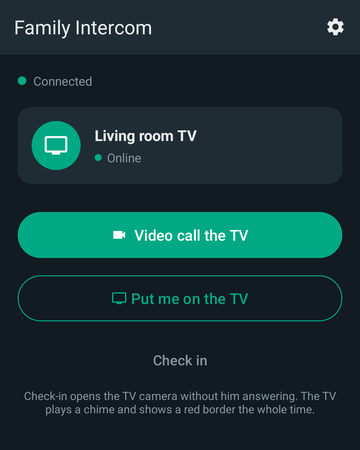
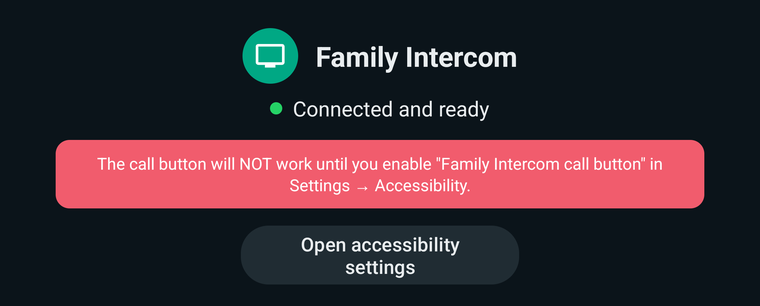

# Family Intercom

Two-way video intercom between a Google TV with a USB webcam and up to four
Android phones. A physical button next to the TV calls everyone, and everyone
who answers is on the call together; any phone can push its own camera onto the
TV screen.

Built so an 80-year-old never has to find an app, choose a contact, or read an
instruction — he presses one button, and the people who love him appear.

```
   ┌──────────────┐                              ┌──────────────┐
   │  Google TV   │                              │  Your phone  │
   │  + USB cam   │◄────── video & audio ───────►│              │
   │  + macro pad │      (direct, encrypted)     │              │
   └──────┬───────┘                              └───────┬──────┘
          │                                              │
          │        ┌──────────────────────────┐          │
          ├───────►│  Cloudflare Worker (free)│◄─────────┤
          │        │  · introduces the peers  │          │
          │        │  · wakes sleeping phones │          │
          │        └──────────────────────────┘          │
          │        ┌──────────────────────────┐          │
          └ ─ ─ ─ ►│  Metered TURN relay      │◄ ─ ─ ─ ─ ┘
                   │  · only if CGNAT blocks  │
                   │    a direct path         │
                   └──────────────────────────┘
```

The server never sees your video or audio. It introduces the two devices to each
other; the call itself goes phone↔TV directly. When both ends are behind CGNAT
and no direct path exists, Metered's relay forwards packets it cannot decrypt.

Running cost: **₹0/month**, with no server to rent, patch or keep alive.

<p align="center">
  
  &nbsp;&nbsp;
  
</p>

Both apps follow WhatsApp's dark look. The front screens show only what matters
at a glance; the server address and home secret live behind **Settings**.

### Group calls

The whole family can be on one call with grandpa:

- **He presses the button:** every phone rings, and each one that answers joins.
  A phone that missed the ring can still join while the call is on.
- **You call him:** anyone else can join from their phone, whose call button
  turns into **Join the call** and shows who is already talking to him.
- **On the TV,** everyone appears in a grid with their name under their picture.
  The call carries on until he hangs up or the last phone leaves.

There is no fixed number of people. Every device sends its picture to every
other one directly (nothing passes through a server), so each extra person costs
the TV another upload; the apps send smaller pictures as the call grows. If
grandpa's TV struggles with a big call, set `MAX_CALL_MEMBERS` on the server to
cap it (see `cloudflare/wrangler.jsonc`).

---

## What you need

| Thing | Notes |
|---|---|
| Google TV set | Or any Android TV. See the risk note below. |
| USB webcam | UVC class (almost all are). Plugs into the TV. |
| USB macro pad | 3 keys ideally: call, answer, hang up. ₹500–1500. |
| Cloudflare account | Free plan, no card. Runs the signalling server. |
| Metered account | Free TURN plan for the relay. 20 GB/month (Metered may ask for a card to unlock it; without one the trial is 500 MB). Going over the limit stops the relay; it does not charge. |
| Firebase project | For push only. Free plan, no card. |
| GitHub account | Builds the APKs for you. |

Would rather run your own VM? `server/` is the same server for any Linux box, with
its own coturn relay: see **[Oracle VM setup](docs/01-server-setup.md)**. The apps
work with either; they only need the server's URL and home secret.

### The one real risk

Budget TVs frequently ship kernels without UVC support, or wire the USB port for
storage only. If the webcam does not enumerate, the fallback is to mount an old
Android phone near the TV as the camera unit — better mic, better echo handling,
and it wakes its own screen. The TV app reports exactly why the camera failed
rather than showing a black rectangle, so you will know within a minute of
plugging it in.

---

## Getting the APKs

**GitHub Actions** builds both APKs on every push, and runs the tests for both
servers. No Android Studio, nothing installed:

1. Fork this repository, or push a copy of it to your own GitHub account.
2. Open the **Actions** tab. The build runs automatically.
3. Download the `apks` artifact — it contains `family-intercom-tv.apk` and
   `family-intercom-phone.apk`.

Before pushing a dependency change, these take a minute and need no SDK:

```bash
python tools/check-deps.py      # do the pinned dependency versions exist?
python tools/preflight.py       # do all resource/manifest references resolve?
```

Full walkthrough, including what to do when a build fails:
**[docs/06-local-build.md](docs/06-local-build.md)**.

Make one signing key and keep using it, so updates install over the previous
version: [android/keystore/README.md](android/keystore/README.md). Without one,
builds use a throwaway debug key.

---

## Setup order

Do these in order; each one depends on the last.

1. **[Server on Cloudflare](cloudflare/README.md)** — the signalling server on the
   free Workers plan, plus the Metered relay. Start here: nothing else works
   without it, and it is where the home secret both apps need is set.
   `https://<your-worker>/health` should show `"relay": true`.
2. **[Firebase](docs/02-firebase.md)** — so a locked phone actually rings. Then
   `/health` shows `"push": "ready"`.
3. **[TV app](docs/03-tv-install.md)** — sideloading, allowing the microphone,
   the accessibility service, and teaching it which key the macro pad sends.
4. **[Phone app](docs/04-phone-install.md)** — one per family member.
5. **[Troubleshooting](docs/05-troubleshooting.md)** — read this before you drive
   to his house.
6. **[Building the APKs](docs/06-local-build.md)** — GitHub Actions, and what to
   do when a build fails.

---

## Repository layout

```
cloudflare/      The server on Cloudflare Workers - free, no card. Has tests.
  src/           worker.js (one Durable Object), turn.js (relay), fcm.js (push)
  test/          Runs server/test's suites against the Worker locally
server/          The same server for your own VM. Zero npm dependencies. Has tests.
  src/           ws-server.js is a hand-rolled RFC 6455 server
  deploy/        setup.sh provisions a bare Oracle VM in one command
  test/          Full call-flow tests; run with `npm test`
android/
  core/          Shared: protocol, signalling client, WebRTC engine, audio
  tv/            Android TV app: UVC camera, global key capture, call screen
  phone/         Phone app: FCM wake, lock-screen ringing, call screen
  keystore/      How to make your signing key (the key itself is never committed)
docs/            Setup guides
tools/           check-deps.py, preflight.py
.github/         CI that builds both APKs and tests both servers
```

## Two design decisions worth knowing

**The accessibility service is not optional.** On Android TV, key events go only
to the foreground app — if grandpa is watching YouTube when he presses the
button, YouTube receives the keypress and the intercom never hears it. An
accessibility service is the only supported way to see keys globally. It must be
enabled by hand once, and the TV app's front screen shows a red banner until it is.

**Auto-answer is never silent.** The check-in feature opens his camera without
him doing anything. Whenever that happens the TV plays a chime and draws a thick
red border around the entire screen for the whole time the camera is
transmitting, and a held key switches the camera off outright. Being able to look
into someone's living room unannounced is not a capability this app has.

---

## Safety and privacy

- Nothing personal is in this repository. Your server address, home secret,
  signing key and Firebase settings stay on your own devices and accounts.
- The home secret is the only thing standing between the internet and your
  family's call system: make it long and random, and never post it.
- The camera never turns on silently. See the design decision above.

Found a security problem? Please report it privately through GitHub's
**Security → Report a vulnerability** on this repository rather than in a
public issue.

## Licence

MIT - see [LICENSE](LICENSE). Use it, change it, and give it to your own family.
